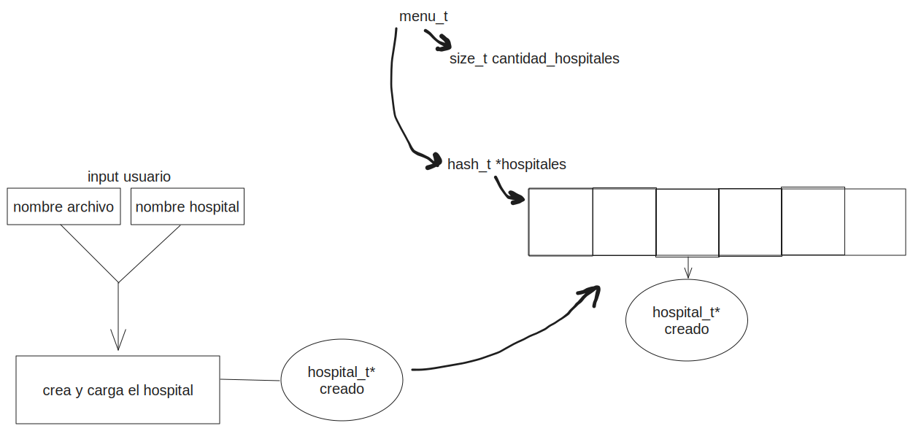

<div align="right">

</div>

# TP2

## Repositorio de (Nombre Apellido) - (Padrón) - (Mail)

- Para compilar:

```bash
make tp2

make pruebas_alumno
```

- Para ejecutar:

```bash
./tp2

./pruebas_alumno
```

- Para ejecutar con valgrind:

```bash
make valgrind-tp2

make valgrind-alumno
```

---

## Funcionamiento

El TDA menu consta de una tabla de hash (con mi implementacion) y una variable que lleva cuenta de los hospitales insertados.

Entonces, en el programa tp2, cuando un usuario escribe el comando de cargar, se le pide un nombre de archivo y un nombre para el hospital (que es basicamente la clave con la que se almacena en el hash).



Luego podemos realizar ciertas operaciones del TDA menu a traves del programa tp2.

Por ejemplo, podemos activar un hospital, para ver los pokemones y los datos que contiene. Este hospital activo lo podemos destruir tambien, para eliminarlo de la tabla de hash y por lo tanto del programa.

Una aclaracion: en el enunciado pide que para identificar a cada hospital usemos un numero. Yo decidi utilizar de cualquier manera un nombre (que podria ser tranquilamente un numero) ya que lo utilizo como clave en la tabla de hash dentro del TDA menu.

---

## Respuestas a las preguntas teóricas

En el tp1 podriamos utilizar cualquiera de las estructuras de datps vistas en la materia.
Por ejemplo, podriamos utilizar una lista enlazada con la implementacion utilizada en la materia.

Aqui las complejidades:

| Lista enlazada               |       |
| ---------------------------- | ----- |
| Crear hospital desde archivo | O(n)  |
| Cantidad                     | O(1)  |
| Hospital a cada pokemon      | O(n)  |
| Hospital aceptar emergencias | O(n)  |
| Hospital obtener pokemon     | O(n)  |
| Hospital destruir            | O(n)  |
| Ordenar por salud            | O(n²) |

Explicacion:

- Crear hospital desde archivo implicaria crear cada pokemon, que es una operacion O(n) y luego insertar al principio cada pokemon en la lista , que es una operacion O(1), pero en promedio es O(n).

- Obtener la cantidad de pokemones seria O(1) porque nuestra estructura aumenta o disminuye la cantidad al momento de la insercion o eliminacion.

- Hospital a cada pokemon es O(n) porque debo iterar los n pokemones que estan en el hospital.

- Hospital aceptar emergencias tambien seria O(n) ya que debo insertar al principio n veces.

- Hospital obtener pokemon, si los pokemones estan ordenados, seria una operacion O(n), ya que debo recorrer las posiciones de la lista hasta la deseada y devolverla.

- Hospital destruir es O(n) ya que debo recorrer el hospital para destruir la memoria de los pokemones almacenados, y luego destruir el hospital como tal.

- Ordenar la lista enlazada por salud tendria complejidad O(n²). Para ordenar la lista, primero debo crear una lista nueva y empezar a comparar con el primer elemento de la lista vieja. Si encuentro uno menor, actualizar el puntero y continuar iterando. Una vez encuentre el pokemon con menos salud, lo agrego al principio de la lista nueva y continuo. En el peor de los casos (que la lista este ordenada descendentemente) realizare todas las comparaciones posibles.

A grandes rasgos, utilizar una lista enlazada quiza no sea la forma mas eficiente. Ya que es prioritario mantener el orden por salud de los pokemones y ordenar luego de insertar en el arbol es una operacion ineficiente.

---

Otra opcion podria ser utilizar un ABB. En este insertariamos comparando por salud.

Aqui las complejidades si asumimos que esta balanceado:

| Arbol binario de busqueda    |       |
| ---------------------------- | ----- |
| Crear hospital desde archivo | O(n²) |
| Cantidad                     | O(1)  |
| Hospital a cada pokemon      | O(n)  |
| Hospital aceptar emergencias | O(n²) |
| Hospital obtener pokemon     | O(n)  |
| Hospital destruir            | O(n)  |
| Ordenar por salud            | O(1)  |

- Crear hospital desde archivo implicaria algo similar al caso anterior. Debemos crear cada pokemon, que es una operacion O(n) y luego insertar cada pokemon en el arbol, en el peor caso (insertar todos a la izquierda o todos a la derecha) es una operacion en total O(n²), pero en promedio es O(n log n).

- Nuevamente cantidad es un dato de mi implementacion que aumenta o disminuye en la insercion o eliminacion respectivamente, por lo que solo hay que devolverlo.

- Hospital a cada pokemon es O(n) ya que debo aplicarle una funcion a cada pokemon del arbol.

- Hospital aceptar emergencias implica recorrer el vector de pokemones ambulancia (O(n)) y la insercion dentro del arbol (que en el peor de los casos es O(n)). Por esto, en el peor caso es O(n²) y en promedio es O(n).

- Para hospital obtener pokemon podriamos recorrer el arbol INORDEN y guardar los elementos en un vector. Esto nos devolveria el arbol ordenado de menor salud a mayor salud, y ahi podriamos utilizar la prioridad que nos dan para acceder a la posicion correcta (O(1)). En total recorrer todo el arbol y accerder a la posicion del vector seria O(n).

- Para destruir el hospital debo recorrer todo el arbol y eliminar cada nodo en el y luego eliminar el arbol en si. Esto seria O(n).

- La utilidad del ABB seria justamente que podemos asumir que al insertar cada pokemon el arbol quedara correctamente ordenado.

Aunque en el peor caso algunas operaciones son ineficientes, en el caso promedio las operaciones del ABB son O(n log n), lo cual es una mejora respecto de la implementacion con vector dinamico donde las operaciones tienden a ser O(n).

Respecto de las pruebas en ambas implementaciones, no deberia haber mayores cambios. Ya que las pruebas se hicieron mirando la interfaz provista y no la implementacion en si. Por ello, si las funciones devuelven lo que el contrato estipula, no deberia haber ningun inconveniente.
